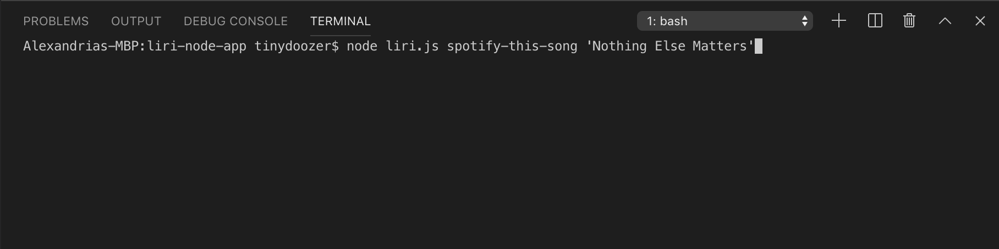
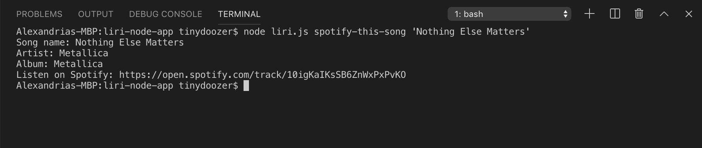
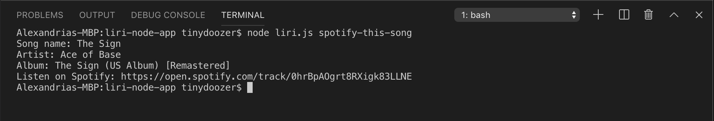
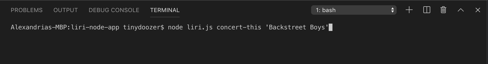
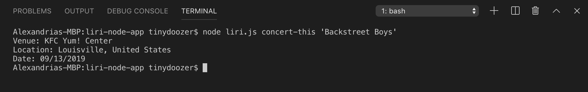
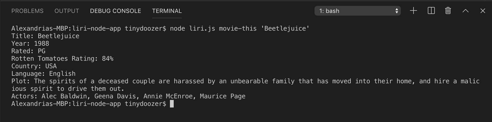
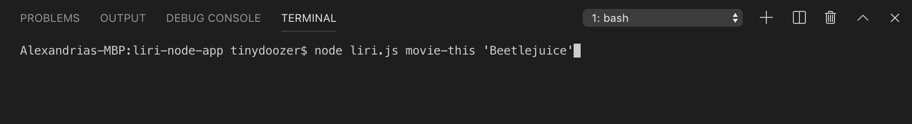
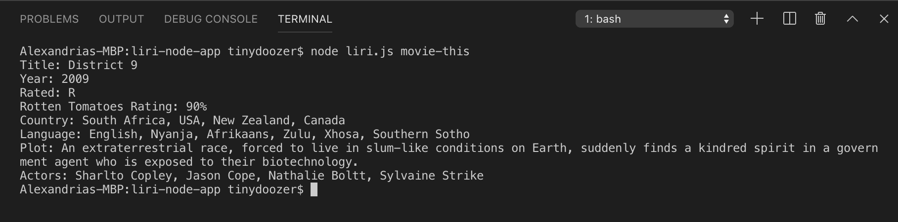
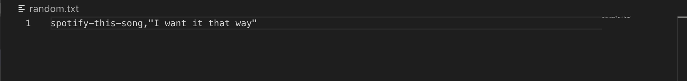
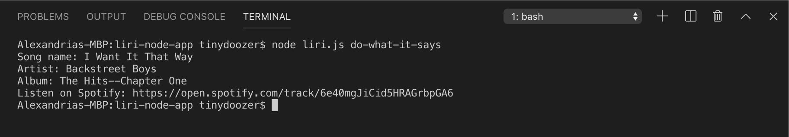

# liri-node-app

LIRI is kind of like SIRI, but instead of speech, it interprets language to give you data. It's a command line node app you can use to find songs, concerts, and movie info. 

As this is a command line interface app, it's not deployed to GitHub pages, but you can view some screenshots below to get an idea of how it works.

## How it Works to Find Songs

On the command line, enter `node liri.js spotify-this-song '[song]'` where `[song]` is the name of the song of your choice.

Hit enter and LIRI displays data from the Spotify API, including song name, artist, album, and a link to listen on Spotify.

If the user doesn't enter a song, the default is The Sign, by Ace of Base. Because 90s.

## How it Works to Find Concerts

On the command line, enter `node liri.js concert-this '[artist]'` where `[artist]` is the artist or band of your choice. 

Hit enter and LIRI displays data from the Bands in Town API, including the venue, location, and date.

If the user doesn't enter an artist or band, the default is Metallica.

## How it Works to Find Movies

On the command line, enter `node liri.js movie-this '[movie name]'` where `[movie name]` is the movie of your choice. 

Hit enter and LIRI displays data from the OMDb API, including title, year released, rating, Rotten Tomatoes rating, country, language, plot, and actors.

If the user doesn't enter a movie title, the default is District 9.

## do-what-it-says

Using the fs node package, LIRI can also pull text from inside a txt file and use it to call one of its commands. In this example, we have `spotify-this-song,"I want it that way"` in the txt file. 

On the command line, enter `node liri.js do-what-it-says` and LIRI will essentially do what the txt file says and in this example, spotify that song!

### APIs Used

[Spotify](https://developer.spotify.com/documentation/web-api/)
[Bands in Town](https://manager.bandsintown.com/support/bandsintown-api)
[OMDb](http://omdbapi.com/)